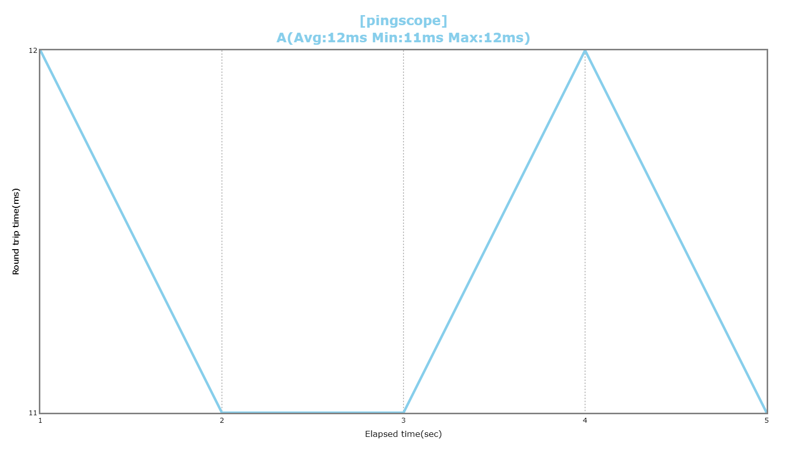

# pingscope
Measuring and graphing ping

## Round trip time tiers
|Rank|Range|Color image|Color name|Color code|
|:-:|:-:|:-:|:-:|:-:|
|S|0 - 9ms||Blue|#0000FF|
|A|10 - 14ms||Skyblue|#87CEEB|
|B|15 - 19ms||Green|#00FF00|
|C|20 - 29ms||Yellow|#FFFF00|
|D|30 - 49ms||Orange|#FFA500|
|E|50ms over||Red|#FF0000|

## Versions

|Version|Summary|
|:--|:--|
|0.1.0|Release pingscope|

## Installation

`pip install pingscope`

## Usage
### pingscope

```python
import pingscope as ps

dst = "www.google.com"
pingFilePath = "./images/usage.ping"
ps.Pingscope().save(pingFilePath, dst)
ps.Pingscope().load(pingFilePath).to_figure_helper().write_image("./images/usage.png")
```
